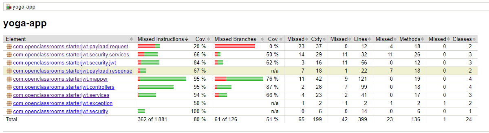
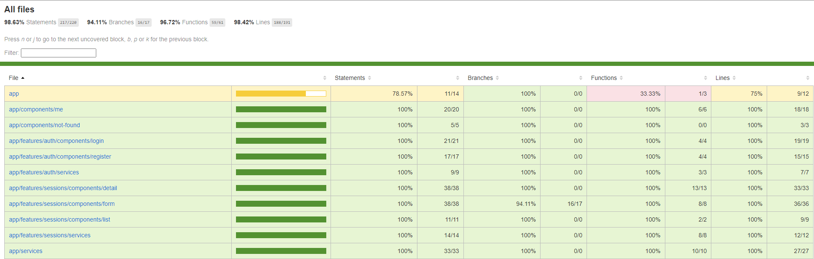
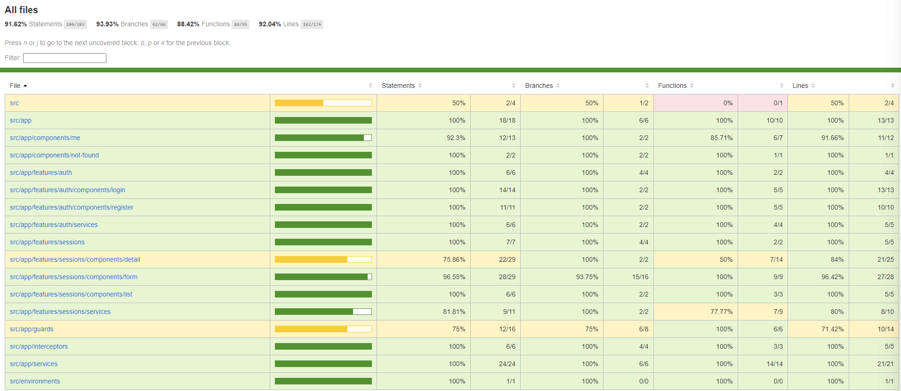

# Yoga
## Table of contents

- Description and goals
- Installation
- Database setup
- Run application
- Run tests
- Technologies
- Compodoc
- Screenshots

## Description and goal

Yoga application concerns unit, integration and e2e testing for the back and front end.

This is a full stack application that allow to configure Yoga classrooms and booking system.
It's just a proof of concept to work around application testing with JUnit, Jest and Cypress.

## Installation

### Clone the Project

Clone these repositories :
> git clone https://github.com/popcodelab/Yoga

### Install Dependencies

#### Back-End:

> mvn clean install

#### Front-End:

> npm install

### Configuring the Back-End

Open the `application.properties` file located in the `back/src/main/resources` directory to Replace the properties with your parameters:

```properties
spring.datasource.url=${APP_DB_URL}
spring.datasource.username=${APP_DB_USERNAME}
spring.datasource.password=${APP_DB_PASSWORD}
```

## Database setup 

Make sure that you have MySQL installed on your system.

1. Log into MySQL using the following command :
> mysql -u `<username>` -p

2. Create the database :

> CREATE DATABASE `<database_name>`;

3. Select the created database :
> USE `<database_name>`;


### Build the database

Use the SQL script located in `ressources\sql\script.sql`  to create the schema :

> SOURCE `<path_to_script.sql>`;
     

Default credential are :
- login: yoga@studio.com
- password: test!1234

## Run application

1. Frontend
   
   - In your terminal, run the command below.
    
        ```bash
        cd front
        npm run start
        ```

     The frontend will launch in your browser at `http://localhost:4200`
  
2. Backend

     - In a separate terminal, run the command below.

          ```bash
          cd back
          mvn spring-boot:run
          ```

        The backend server will launch at `http://localhost:8080`

---

## Run Tests

### Backend - Unit and integration tests

1. Run tests and generate a coverage report.

    ```bash
    cd back
    mvn clean test
    ```
    
2. The report has been generated in  `back/target/site/jacoco` directory. Open the `index.html` file in a web browser.



### Frontend - Unit and Integration

1. Run tests and generate a coverage report.

    ```bash
    cd front
    npm run test
    ```

2. The report has been generated in `front/coverage/jest/lcov-report` directory. Open the `index.html` file in a browser.



### Frontend - End-to-End

1. Run the Cypress Test Runner.

    ```bash
    npm run e2e
    ```

2. Run the end-to-end tests and generate the coverage report.

    ```bash
    npm run e2e:coverage
    ```
3. The report has been generated in `front/coverage/lcov-report` directory. Open the `index.html` file in a browser.



## Technologies
Front-end :  


Back-end :  


<br>
<hr>

 <div align="center">

 [](https://forthebadge.com)
 [](https://forthebadge.com)
 [](https://forthebadge.com)
 [](https://forthebadge.com)

</div>
<hr/>